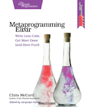

```
Roberto Nogueira  
BSd EE, MSd CE
Solution Integrator Experienced - Certified by Ericsson
```
# eBook Metaprogramming Elixir



**About**

Learn everything you need to about the subject of this `eBook` project.

[Homepage](https://pragprog.com/book/cmelixir/metaprogramming-elixir)

## Topics
```
Acknowledgements
Introduction
[ ] Metaprogramming—An Essential Feature
[ ] How to Read This Book
[ ] Running the Code Exercises
[ ] Online Resources
[ ] The Language of Macros excerpt
The World Is Your Playground
[ ] Macro Rules
[ ] The Abstract Syntax Tree—Demystified
[ ] Macros: The Building Blocks of Elixir
[ ] Code Injection and the Caller’s Context
[ ] Further Exploration
Extending Elixir with Metaprogramming
[ ] Custom Language Constructs
[ ] Smarter Testing with Macros
[ ] Extending Modules
[ ] Using Module Attributes for Code Generation
[ ] Compile-Time Hooks
[ ] Further Exploration
Advanced Compile-Time Code Generation
[ ] Generating Functions from External Data
[ ] MIME-Type Conversion in Ten Lines of Code
[ ] Building an Internationalization Library excerpt
[ ] Code Generation from Remote APIs
[ ] Further Exploration
How to Test Macros
[ ] Setting Up Your Test Suite
[ ] Deciding What to Test
[ ] Integration Testing
[ ] Unit Tests
[ ] Test Simple and Test Fast
[ ] Further Exploration
Creating an HTML Domain-Specific Language
[ ] Getting Domain Specific
[ ] Start by Defining the Minimum Viable API
[ ] Support the Entire HTML Spec with Macros
[ ] Enhance Your API with HTML Attribute Support
[ ] Generate Less Code by Walking the AST
[ ] To DSL or Not to DSL?
[ ] Further Exploration
With Great Power Comes Great Responsibility (and Fun!)
[ ] When and Where to Use Macros
[ ] Avoiding Common Pitfalls
[ ] Bending the Rules
[ ] Build the Future
```
